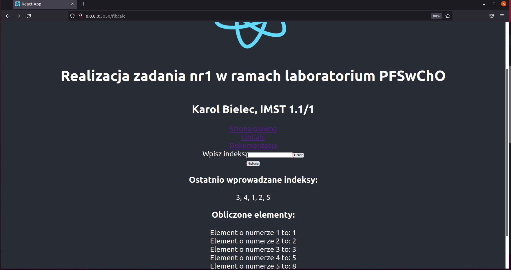

# PFWCHOz1
#Zdanie wykonane na podstawie laboratorium nr 9
##Zmienione:
      
-** konfiguracja umożliwiająca poprawne działanie aplikacji
-** podział na  stronę z kalkulatorem, stronę główną i opis
-** dodanie strony z opisem
-** ograniczenie indeksu elementu do 20
-** dodanie przycisku "Historia" wyświetlającego 10 ostatnich indeksów
      
## Uruchamianie:
      
-** git clone Barlitos/PFWCHOz1
-** docker-compose up
uwaga: aplikacja dostępna pod adresem 0.0.0.0:3050
w przypadku 127.0.0.1 oraz localhost:3000 3050 itp. napotkałem problemy z jej dostępnością
lub działaniem 
      
## Screen:

